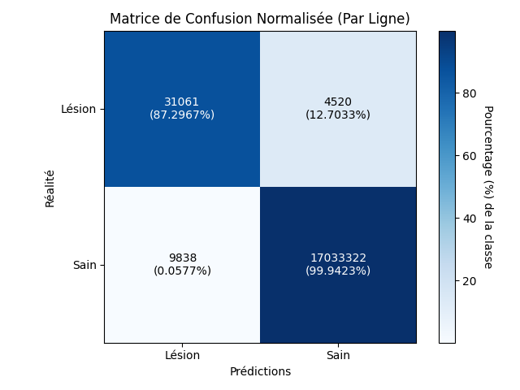

# PRJIAV : Segmentation de lesions SEP

La sclérose en plaques (SEP) est une maladie neurodégénérative chronique qui provoque
des lésions inflammatoires au niveau de la substance blanche du cerveau. L'identification
et la segmentation des nouvelles lésions sont cruciales pour le suivi clinique des patients.

## Objectifs :

- Développer un algorithme de segmentation capable d'identifier les nouvelles lésions à partir de deux images IRM
  cérébrales séparée dans le temps.
- Comparer les performances de différents algorithmes.

## Données :

Les données disponibles pour la réalisation de ce projet sont les bases de données MSSEG-1 et MSSEG-2.

- MSSEG-1 : 53 patients, segmentation par sept experts avec un consensus contenant l'ensemble des lésions identifiées.

  

  *(en rouge le consensus des lésions)*

- MSSEG-2 : 40 patients différents de MSSEG-1, 2 IRM par patient séparé d'un certain temps, segmentation par quatre
  experts avec un consensus contenant uniquement les nouvelles lésions du second IRM.


  

  *(en rouge le consensus des nouvelles lésions)*

L'ensemble des IRM sont fournis en format NIfTI (.nii ou .nii.gz). Il s'agit de données volumétriques 3D.
Les données étant volumineuses, SaturnCloud a été utilisé pour leur traitement et l'entrainement des algorithmes. Les
scripts utilisés sont donc écrits pour fonctionner en priorité avec cette plateforme.

L'ensemble des dépendances pour les scripts et programme utilisés peuvent être installées avec la commande :
```bash
pip install -r requirements.txt
```

## Prétraitement :

Afin de faciliter l'entrainement des algorithmes, il a été nécessaire de pré-traiter les données. Pour cela, nous avons
réalisé les étapes suivantes :

0. Normaliser l'arborescence des dossiers : les données ont été fournis dans trois dossiers d'arborescence différente
- ```
  MSSEG-1
  ├── 01016SACH
  │   ├── 3DFLAIR.nii
  │   ├── 3DT1GADO.nii
  │   ├── 3DT1.nii
  │   ├── Consensus.nii
  │   ├── DP.nii
  │   ├── elastix.log
  │   ├── IterationInfo.0.R0.txt
  │   ├── IterationInfo.0.R1.txt
  │   ├── IterationInfo.0.R2.txt
  │   ├── IterationInfo.0.R3.txt
  │   ├── ManualSegmentation_1.nii
  │   ├── ManualSegmentation_2.nii
  │   ├── ManualSegmentation_3.nii
  │   ├── ManualSegmentation_4.nii
  │   ├── ManualSegmentation_5.nii
  │   ├── ManualSegmentation_6.nii
  │   ├── ManualSegmentation_7.nii
  │   ├── T2.nii
  │   ├── transformix.log
  │   └── TransformParameters.0.txt
  └── ...
  ```
- ```
  MSSEG-1 test
  ├── 01045BRPO_1
  │   ├── 3DFLAIR.nii.gz
  │   ├── 3DT1GADO.nii.gz
  │   ├── 3DT1.nii.gz
  │   ├── Consensus.nii.gz
  │   ├── DP.nii.gz
  │   ├── input.json
  │   ├── ManualSegmentation_1.nii.gz
  │   ├── ManualSegmentation_2.nii.gz
  │   ├── ManualSegmentation_3.nii.gz
  │   ├── ManualSegmentation_4.nii.gz
  │   ├── ManualSegmentation_5.nii.gz
  │   ├── ManualSegmentation_6.nii.gz
  │   ├── ManualSegmentation_7.nii.gz
  │   └── T2.nii.gz
  └── ...
  ```
- ```
  MSSEG-2
  ├── 013
  │   ├── flair_time01_on_middle_space.nii.gz
  │   ├── flair_time02_on_middle_space.nii.gz
  │   ├── ground_truth_expert1.nii.gz
  │   ├── ground_truth_expert2.nii.gz
  │   ├── ground_truth_expert3.nii.gz
  │   ├── ground_truth_expert4.nii.gz
  │   └── ground_truth.nii.gz
  └── ...
  ```
Les données utiles conservées sont le consensus des experts (`idpatient_consensus.nii.gz`) et le ou les deux IRM (`idpatient_flair_0.nii.gz` + `idpatient_flair_1.nii.gz` uniquement pour MSSEG-2). On obtient la structure suivante (pour MSSEG-1) :
```
  MSSEG-1-preprocessed-0
  ├── 01016_consensus.nii.gz
  ├── 01016_flair_0.nii.gz
  ├── 01038_consensus.nii.gz
  ├── 01038_flair_0.nii.gz
  └── ...
  ```
Cette arborescence peut être obtenue avec la commande suivante :
```bash
python scripts/0_create_file_tree.py --input $HOME/workspace/MSSEG-1 --output $HOME/workspace/MSSEG-1-preprocessed-0 --database-type MSSEG-1
```

1. Extraction du cerveau : Chaque IRM contient l'ensemble de la tête du patient, pour simplifier la compréhension des données par les modèles, nous avons utilisé HD-BET pour extraire le cerveau de chaque IRM. Il s'agit d'un outil en ligne de commande basé sur le modèle nnUNet. Le script suivant permet d'extraire le cerveau sur l'ensemble des IRM dans un dossier :
```bash
python scripts/1_extract_brain.py --input $HOME/workspace/MSSEG-1-preprocessed-0 --output $HOME/workspace/MSSEG-1-preprocessed-1
```

2. Redimensionnement des images à une taille constante :
```bash
python scripts/2_crop_brain.py --input $HOME/workspace/MSSEG-1-preprocessed-1 --output $HOME/workspace/MSSEG-1-preprocessed-2
```

Les images fournies étaient déjà normalisées, il n'a donc pas été nécessaire de réaliser cette étape.


## Méthodes :

À partir des données, deux méthodes se distinguent pour entrainer un modèle répondant aux objectifs du projet.

### Methode 1 : Entrainement d'un modèle sur MSSEG-1

La base de données MSSEG-1 contient les segmentations de l'ensemble des lésions de 53 patients. À partir de ces données, il est possible d'entrainer un modèle qui apprend à reconnaitre les lésions dans un cerveau.
Ce modèle ne répond pas directement à l'objectif du projet. Cependant, les images de MSSEG-1 et de MSSEG-2 sont relativement semblable. Le modèle entrainé peut donc être utilisé sur MSSEG-2 pour segmenter l'ensemble des lésions au temps 0 et au temps 1. Les nouvelles lésions, l'information que nous recherchons, correspond ainsi à la différence entre les deux ségmentations.

Pour calculer la différence entre les prédictions du temps 0 et du temps 1, nous avons testé deux solutions :
 - Soustraction : `Temps 1 - Temps 0 = Nouvelles lésions` Cette méthode à l'avantage d'être simple à mettre en place, mais les anciennes lésions ayant grossi ne seront pas completement retiré
 - Intersection : Retirer l'ensemble des zones segmenté au temps 1 qui se superpose au moins partiellement avec une zone du temps 0


### Methode 2 : Entrainement d'un modèle sur MSSEG-2

Cette méthode consiste à entrainer un modèle à partir d'images qui combinent les deux temps : t0 et t1.
Pour combiner les deux images, on en crée simplement une nouvelle qui possède deux canaux.
Comme la vérité terrain ne contient que les lésions au temps 1, ce modèle va apprendre à segmenter uniquement les nouvelles lésions et à exclure les anciennes.


Voici une illustration de ce que la combinaison des deux images pourrait donner avec des images RGB. Si on considère l'image au temps 0 comme étant une image rouge, et celle au t1 une image bleu, alors la nouvelle image serait une image contenant 2 canaux. Dans cet exemple, elle serait représentée en violet.

## Architectures

Nous avons étudié trois architectures différentes pour appliquer ces deux méthodes. Celles-ci sont détaillées ci-dessous.

Les architectures Mask-RCNN et 3D U-Net n'ont pas montré des résultats satisfaisant lors de nos premiers tests. C'est pourquoi n'avons pas mené une étude approfondie avec celles-ci. Néanmoins, ces architectures peuvent potentiellement permettre d'obtenir des bons résultats en y consacrant davantage de temps. C'est pourquoi le code est disponible dans ce dépôt. 

### Mask-RCNN

Mask R-CNN est un modèle de détection et de segmentation d'objets qui étend Faster R-CNN en ajoutant une branche supplémentaire pour la segmentation des masques. Il utilise un réseau de neurones convolutif (CNN) pour extraire des caractéristiques, un réseau de propositions de région (RPN) pour générer des propositions d'objets, puis des têtes distinctes pour la classification, la détection des boîtes englobantes et la segmentation des masques. Cette architecture permet une segmentation précise des objets tout en conservant de bonnes performances en détection.


*Architecture Mask-RCNN*

L'implémentation de notre modèle Mask-RCNN est présente sous forme d'un notebook Jupyter dans le dossier `maskRCNN` de ce dépot. 

```bash
jupyter notebook maskRCNN/mask_rcnn.ipynb
```

### 3D U-Net

[3D U-Net](https://github.com/wolny/pytorch-3dunet) est une architecture de réseau de neurones convolutionnels conçue pour la segmentation d'images volumétriques. La principale différence avec l'architecture de U-Net est la possibilité de traité d'image 3D : Il repose sur une structure en U, avec un chemin de contraction pour l'extraction des caractéristiques et un chemin d'expansion pour la reconstruction précise de la segmentation. Les connexions par skip entre ces deux chemins permettent de conserver les informations spatiales importantes tout en améliorant la précision de la segmentation.


*Architecture 3D U-Net*

Pour entrainer le modèle 3D U-Net, il faut d'abord convertir les données au format h5 avec le script suivant :
```bash
python 3d-unet/0_prepare.py
```

Ensuite l'entrainement peut être lancé avec la commande suivante :
```bash
python 3d-unet/1_train.py
```

Finalement, l'inférence peut être réalisée avec le script suivant :
```bash
python 3d-unet/2_inference.py
```


### nnU-Net

[nnU-Net](https://github.com/MIC-DKFZ/nnUNet) est une version automatisée et optimisée de U-Net, conçue pour s’adapter automatiquement à n’importe quel jeu de données de segmentation d’images médicales. Contrairement aux architectures classiques nécessitant un réglage manuel, nnU-Net ajuste automatiquement sa configuration (prétraitement, architecture, post-traitement) en fonction des caractéristiques des données. L'architecture créé est proche d'un modèle 2D/3D U-Net. L'implémentation de nnU-Net est manipulable via une interface en ligne de commande, cela ne nécessite donc pas d'écriture de code. 


*Voici des exemples de datasets qui peuvent être traités par nnU-Net.
a. CT-scan
b. Imagerie moléculaire par fluorescence.
c. CT-scan
d. IRM (T1)
e. Microscopie électronique à balayage
f. IRM (T1, T1 avec agent de contraste, T2, FLAIR)*

Pour entrainer un modèle nnU-Net, nous avons créé un dossier par configuration dans `nnUNetv2/models`. Dans chaque dossier, les scripts suivants sont disponibles :
  
- `0_construct_dataset.py` : Créer un dataset nnU-Net dans avec l'arborescence et les conventions de nommage attendu par le modèle.
- `1_preprocess_dataset.py` : Réalise l'étape interne à nnU-Net de prétraitement des données et conversion des données.
- `2_train.py <fold>` : Entraine le modèle sur le pli spécifié (0 à 4).
- `3_predict.py` : Réalise l'inférence sur le jeu de test.
- `4_evaluate.py` : Calcule les métriques sur le jeu de test.

Le fichier `constants.sh` permet de configurer divers paramètres de nnU-Net.


## Métriques
Une bonne pratique pour évaluer une tâche de segmentation est d'utiliser à la fois des métriques basées sur les voxels, et des métriques basées sur les surfaces.
- Métriques voxel : Elles évaluent la correspondance globale en volume entre la segmentation et la vérité terrain, indiquant si la quantité de pixels/voxels segmentés est correcte.
- Métriques surfaciques : Elles vérifient la précision des contours et la forme de la segmentation, détectant les erreurs sur les bords et les irrégularités.

Nous utiliserons Dice (voxel) et la distance d'Hausdorff (surface).

### Dice

*Illustration du calcul de la métrique Dice*

### Distance d'Hausdorff


## Validation et test

Nous utilisons une validation croisée sur 5 plis pour évaluer notre modèle.
Les images du jeu de test ne sont pas intégrées à la valisation croisée. 
Nous avons 11 patients de test pour la méthode 1 (sur 53 patients au total), et 4 patients de test pour la méthode 2 (sur 36 patients au total).
Les 5 modèles issus des 5 plis sont combinés en un seul (via une [moyenne](https://github.com/MIC-DKFZ/nnUNet/blob/master/documentation/how_to_use_nnunet.md)). Ce modèle unique est évalué sur le jeu de test.


*Illustration stratégie de valisation et de test*

## Résultats

### Mask-RCNN

Nos résultats avec Mask-RCNN n'ont pas été satisfaisants. Le modèle n'apprend pas correctement à segmenter les lésions et prédit simplement du bruit. Mask-RCNN est une architecture plus adaptée à la détection d'objet que la segmentation d'image médicale. Nous avons donc rapidement abandonné cette approche.


*Prédiction du modèle Mask-RCNN*

### 3D U-Net

Avec 3D U-Net, nous avons obtenu des résultats plus cohérents. Le modèle apprend à reconnaitre les lesions mais la segmentation n'est pas binaire. Le résultat est une probabilité de présence de lésion pour chaque pixel. Il est donc nécessaire de définir un seuil pour binariser la segmentation. Bien réglé, le resemble correctement à la vérité terrain. Cependant, nous avons obtenu de meilleurs résultats avec nnUNet qui est également basé sur un modèle 3D U-Net. Nous n'avons donc pas approfondi cette approche.


*Prédiction du modèle 3D U-Net*

### nnU-Net

C'est avec nnU-Net que nous avons obtenu les meilleurs résultats. Nous l'avons utilisé pour poursuivre les deux méthodes de segmentation des nouvelles lésions décrites précédemment :

#### Méthode 1

Avec la méthode 1, nous avons entrainé un modèle pour segmenter l'ensemble des lésions dans le cerveau. Nous avons effectué l'entrainement des 5 plis recommandé par nnU-Net sur une cinquantaine d'époques. Les résultats obtenus sont les suivants sur MSSEG-1 :

| Dice  |
|-------|
| 0.782 |



Nous obtenons ainsi un modèle performant pour la ségmentation de l'ensemble des lésions dans le cerveau. Visuellement le résultat est également coherent :


*Prédiction sur une image du jeu de test (en rouge le consensus, en bleu la prédiction)*

On cherche maintenant à segmenter les nouvelles lésions sur MSSEG-2. Pour cela, nous avons utilisé le modèle pour prédire l'ensemble des lésions sur les images du temps 0 et du temps 1 :


*Prédiction sur une image du jeu de test (en jaune les lésions prédites pour le temps 0, en bleu celles pour le temps 1)*

En calculant la différence entre les deux prédictions, nous obtenons uniquement les nouvelles lésions :


*Différence entre les deux prédictions temps 0 et temps 1 (en rouge le consensus, en vert les nouvelles lésions prédites)*

Visuellement le résultat est semblable. Cependant, les lésions ayant grossi ne sont pas complètement retirées. Il est possible d'améliorer ce résultat en utilisant la méthode d'intersection décrite précédemment. On obtient alors les résultats suivants :

| Soustraction                                                                           | Intersection                                                                           |
|----------------------------------------------------------------------------------------|----------------------------------------------------------------------------------------|
| Dice : 0.244                                                                           | Dice : 0.385                                                                           |
|  |  |

Bien que les résultats furent visuellement semblable, les métriques n'apprécient pas les artéfacts laissés par le calcul entre le temps 0 et le temps 1. La méthode d'intersection permet toutefois de bien améliorer le score. Ces résultats sont encourageants et il serait intéressant d'affiner la méthode de calcul pour améliorer les scores.

#### Méthode 2

Pour la seconde méthode, nous avons entrainé un modèle directement pour segmenter les nouvelles lésions à partir des deux images IRM en même temps. Les résultats obtenus au niveau des métriques pour la segmentation des nouvelles lésions sont bien plus élevés :

| Dice | Distance de Hausdorff |
|-----------|-----------|
| 0.708  | mm  |

Sur la matrice de confusion, on observe que le modèle permet d'obtenir très peu de faux-negatifs. Ceci est particulièrement intéressant pour une application médicale. Il est important de detecter toutes les lésions.


*Matrice de confusion de la méthode 2*

Voici une inférence réalisée sur une image du jeu de test. On observe que la segmentation prédite est cohérente. 


*Prédidction sur un image du jeu de test* 


*Vérité terrain associée à l'image*

Sur les courbes d'apprentissage ci-dessous, on constate un phénomène de surapprentissage. De plus, il y a une instabilité sur la courbe de perte de validation. Cela peut être dû à jeu de validation trop petit, pas adapté au problème. 


*Courbes d'apprentissage du modèle de la méthode 2*

## Pour aller plus loin

